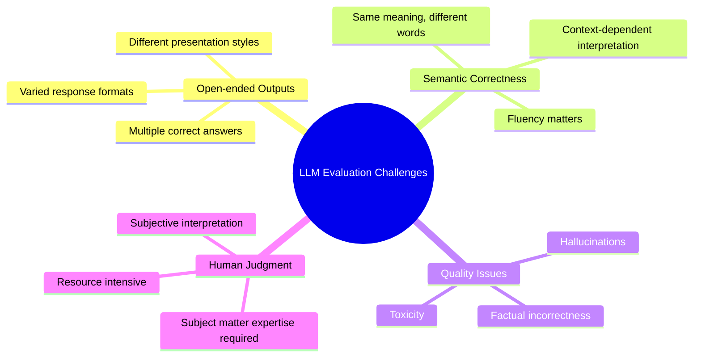
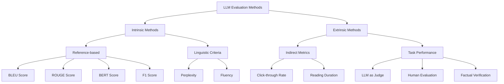
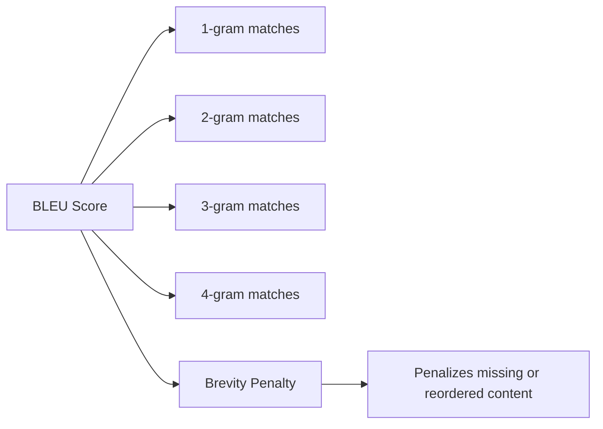
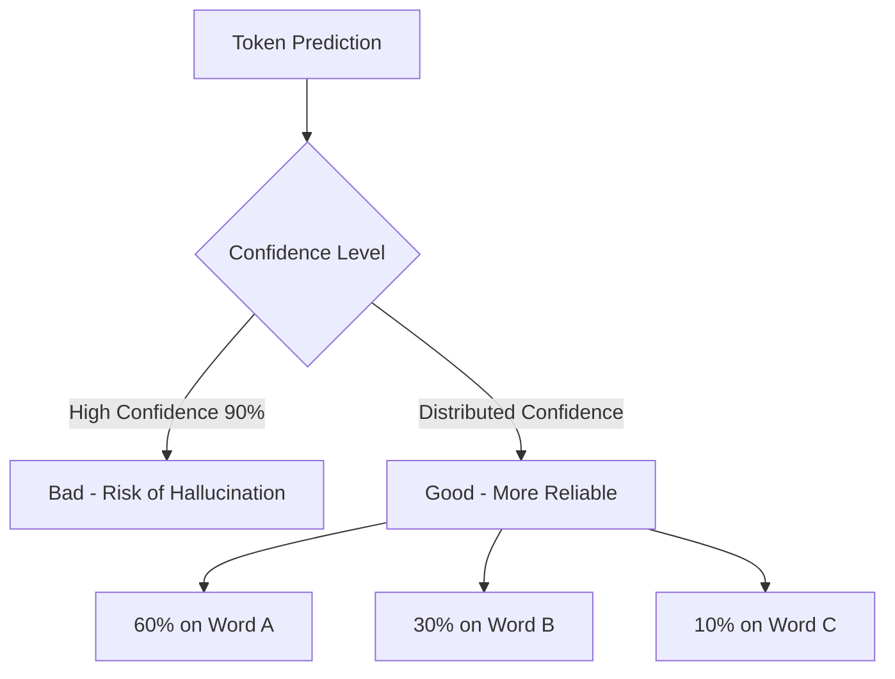
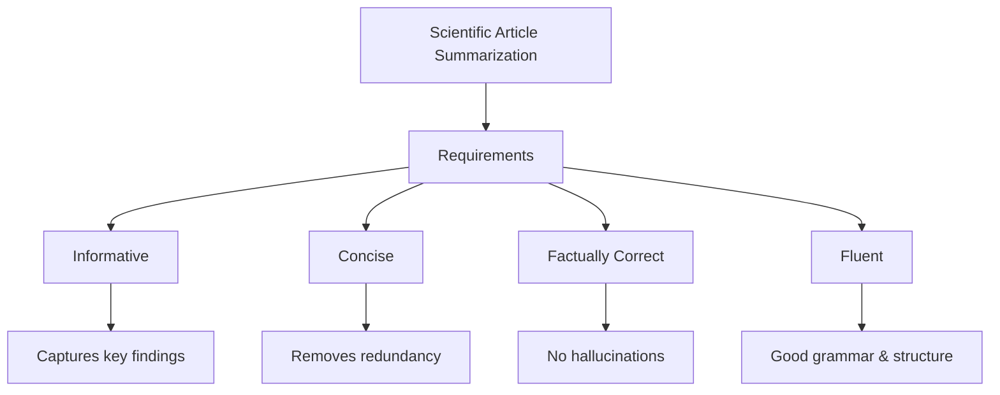
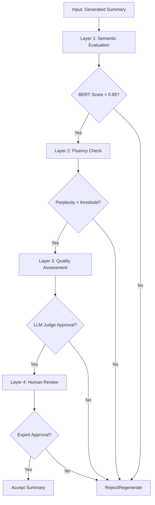

# LLM Evaluation Methods: A Comprehensive Guide 🚀

## Table of Contents
- [Introduction](#introduction)
- [Challenges in LLM Evaluation](#challenges-in-llm-evaluation)
- [Types of Evaluation Methods](#types-of-evaluation-methods)
- [Intrinsic Evaluation Methods](#intrinsic-evaluation-methods)
- [Extrinsic Evaluation Methods](#extrinsic-evaluation-methods)
- [Implementation Examples](#implementation-examples)
- [Use Case: Scientific Article Summarization](#use-case-scientific-article-summarization)
- [Layer-wise Evaluation Pipeline](#layer-wise-evaluation-pipeline)
- [Best Practices](#best-practices)

## Introduction

When working with generative AI and Large Language Models (LLMs), traditional machine learning evaluation metrics like accuracy, recall, and F1 score are often insufficient. This guide provides a comprehensive overview of LLM evaluation methods, their applications, and implementation strategies.

## Challenges in LLM Evaluation



### Key Challenges Explained

| Challenge | Description | Example |
|-----------|-------------|---------|
| **Open-ended Outputs** | LLMs can produce correct answers in multiple formats | "The capital of France is Paris" vs "Paris is the capital of France" |
| **Semantic Correctness** | Same words can have different meanings in different contexts | "Walking on the bank of river" vs "Bank as a financial institute" |
| **Hallucinations** | Model generates plausible but incorrect information | Inventing facts or references |
| **Need for Human Judgment** | Some evaluations require domain expertise | Technical summaries need expert review |

## Types of Evaluation Methods



## Intrinsic Evaluation Methods

Intrinsic methods compare output quality against reference data or linguistic criteria.

### 1. Accuracy

**What it is:** Measures exact match between prediction and reference.

**When to use:** 
- Classification tasks
- When full match matters
- Simple yes/no questions

```python
# Formula
accuracy = (number_of_exact_matches / total_predictions) * 100
```

### 2. F1 Score (Token-based)

**What it is:** Balance between precision and recall at token level.

**Formulas:**
- **Precision:** How much of prediction is correct?
- **Recall:** How much of reference is covered?

```python
# Token-based F1 calculation
precision = len(common_tokens) / len(predicted_tokens)
recall = len(common_tokens) / len(reference_tokens)
f1_score = 2 * (precision * recall) / (precision + recall)
```

**When to use:** 
- Question-answering systems
- When partial correctness matters

### 3. BLEU Score (Bilingual Evaluation Understudy)

**What it is:** Measures n-gram overlap between prediction and reference with brevity penalty.



**Key Features:**
- Checks 1-gram to 4-gram matches
- Penalizes missing or reordered content
- More strict than other metrics

**When to use:** Machine translation tasks

### 4. ROUGE Score (Recall-Oriented Understudy for Gisting Evaluation)

**What it is:** Measures how much of the reference is covered by the prediction.

| ROUGE Type | Description | Focus |
|------------|-------------|-------|
| ROUGE-1 | Unigram overlap | Individual words |
| ROUGE-2 | Bigram overlap | Word pairs |
| ROUGE-L | Longest common subsequence | Sentence structure |

**When to use:** Text summarization tasks

### 5. Perplexity

**What it is:** Measures model confidence in predictions. Lower confidence per token = higher perplexity = better model.



**When to use:** 
- Language modeling tasks
- Evaluating text fluency

### 6. BERT Score

**What it is:** Uses contextual embeddings to measure semantic similarity.

**Key Features:**
- Computes contextual embeddings
- Provides precision, recall, and F1 scores
- Captures semantic meaning, not just word matches

**When to use:** Any task requiring semantic understanding

## Extrinsic Evaluation Methods

Extrinsic methods evaluate LLMs based on downstream task performance without reference data.

### Comparison Table

| Method | Type | Description | Use Case |
|--------|------|-------------|----------|
| **Factual Verification** | Automated | Checks factual accuracy using external sources | News summaries, Q&A systems |
| **LLM as Judge** | Automated | Uses another LLM to evaluate outputs | Scalable quality assessment |
| **Human Judgment** | Manual | Expert review of outputs | High-risk domains (medical, legal) |
| **Click-through Rate** | Behavioral | Measures user engagement | Content generation |
| **Reading Duration** | Behavioral | Time spent on generated content | Blog posts, articles |

## Implementation Examples

### Basic Setup

```python
import evaluate
import numpy as np
from transformers import AutoTokenizer, AutoModel

# Load evaluation metrics
accuracy_metric = evaluate.load("accuracy")
f1_metric = evaluate.load("f1")
bleu_metric = evaluate.load("bleu")
rouge_metric = evaluate.load("rouge")
bertscore_metric = evaluate.load("bertscore")
```

### Example: Computing BLEU Score

```python
# Example predictions and references
predictions = ["The capital is Paris"]
references = [["Paris is the capital"]]

# Compute BLEU score
results = bleu_metric.compute(predictions=predictions, references=references)
print(f"BLEU Score: {results['bleu']}")
```

### Example: LLM as Judge

```python
import openai

def llm_judge(question, response_a, response_b):
    prompt = f"""
    Question: {question}
    Response A: {response_a}
    Response B: {response_b}
    
    Which response is more accurate, fluent, and helpful? 
    Reply only with 'A' or 'B'.
    """
    
    response = openai.ChatCompletion.create(
        model="gpt-4",
        messages=[{"role": "user", "content": prompt}]
    )
    
    return response.choices[0].message.content
```

## Use Case: Scientific Article Summarization

### Requirements Analysis



## Layer-wise Evaluation Pipeline

### Comprehensive Evaluation Strategy

| Layer | Method | Type | Purpose |
|-------|--------|------|---------|
| **Layer 1** | BERT Score + ROUGE | Quantitative, Reference-based | Semantic meaning & coverage |
| **Layer 2** | Perplexity | Quantitative, Reference-free | Fluency assessment |
| **Layer 3** | LLM as Judge | Qualitative, Scalable | Coherence, facts, quality |
| **Layer 4** | Human Review | Qualitative, Expert | High-risk assessment |

### Pipeline Implementation



## Best Practices

### 1. Choose the Right Metric

| Task Type | Recommended Metrics |
|-----------|-------------------|
| Machine Translation | BLEU Score |
| Text Summarization | ROUGE Score + BERT Score |
| Question Answering | F1 Score + Accuracy |
| Content Generation | Perplexity + LLM Judge |
| High-risk Applications | All above + Human Review |

### 2. Multi-layer Evaluation


### 3. Tools and Libraries

| Tool/Library | Purpose | Link |
|--------------|---------|------|
| **Hugging Face Evaluate** | General metrics | [evaluate](https://huggingface.co/docs/evaluate) |
| **RAGAS** | RAG evaluation | [ragas](https://github.com/explodinggradients/ragas) |
| **Serper AI** | Factual verification | [serper.dev](https://serper.dev) |
| **OpenAI API** | LLM as Judge | [openai.com](https://openai.com) |

## Conclusion

Effective LLM evaluation requires:
1. Understanding the limitations of traditional metrics
2. Combining multiple evaluation methods
3. Creating task-specific evaluation pipelines
4. Balancing automated and human evaluation

Remember: No single metric captures all aspects of LLM performance. Always use a combination of methods tailored to your specific use case.

---

## References

- [Holistic Evaluation of Language Models (HELM)](https://crfm.stanford.edu/helm/)
- [BERTScore: Evaluating Text Generation with BERT](https://arxiv.org/abs/1904.09675)
- [BLEU: a Method for Automatic Evaluation of Machine Translation](https://www.aclweb.org/anthology/P02-1040.pdf)
- [ROUGE: A Package for Automatic Evaluation of Summaries](https://www.aclweb.org/anthology/W04-1013/)

## Contributing

Feel free to contribute to this guide by submitting pull requests or opening issues for discussion.

## License

This guide is released under the MIT License.
